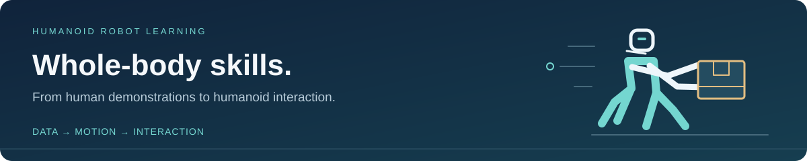

  

<h1 align="center">Awesome Humanoid Loco-Manipulation</h1>

  <strong>A focused reading list for humanoid whole-body manipulation and interaction.</strong>

  <a href="README.md">English</a> · <a href="README.zh-CN.md">简体中文</a> · <a href="CONTRIBUTING.md">Contribute</a>

  
  
  

Humanoid loco-manipulation couples **locomotion, balance, and manipulation**: carrying an object while walking, reaching with the whole body, or making contact with a scene. This collection starts with the data pipelines that make those skills learnable and can grow into additional research topics.

**Initial curation:** 2026-10-08 · **17 entries** · Selected coverage, with original summaries and primary-source links.

### Contents

- [Humanoid Interaction Locomanipulation Data Engine](#humanoid-interaction-locomanipulation-data-engine)
  - [Generation & interaction-preserving retargeting](#generation--interaction-preserving-retargeting)
  - [Demonstration capture & human-to-humanoid transfer](#demonstration-capture--human-to-humanoid-transfer)
  - [Human interaction datasets & physics foundations](#human-interaction-datasets--physics-foundations)
- [Contributing & adding topics](#contributing--adding-topics)
- [Related collections](#related-collections)

## Humanoid Interaction Locomanipulation Data Engine

**Scope.** Methods and resources that collect, reconstruct, retarget, refine, or augment demonstrations for humanoid whole-body interaction and loco-manipulation. A data engine here may be one stage of a learning pipeline; it does not need to generate data end to end.

**Reading guide.** Start with **InterMimicGen / OmniRetarget** for interaction-preserving motion data, **HumanoidMimicGen** for planning-based demonstration expansion, **GRAIL / HumanX** for video-based synthesis, and **TWIST2 / HuMI** for collection interfaces.

**Table notes.** Entries are ordered newest first by the first public release, independently of the venue year. “arXiv” means no venue is recorded here. Resource links point to author-provided material; a project or repository link does not imply that all code or data is released. See [source notes](docs/SOURCES.md) for release details and provenance.

### Generation & interaction-preserving retargeting

These works produce or expand robot reference motions and demonstrations through retargeting, synthesis, or planning.

| Paper | First release / venue | Input → output | One-sentence takeaway | Resources |
| :--- | :--- | :--- | :--- | :--- |
| [**InterMimicGen**](https://arxiv.org/abs/2610.06850) Scaling Humanoid Loco-Manipulation through Self-Evolving Motion Imitation | 2026-10 arXiv | HOI MoCap → executable robot motions | Closes a data flywheel between contact-preserving retargeting, generalist tracking, and execution-filtered augmentation to grow dexterous whole-body interaction motions. | [Paper](https://arxiv.org/abs/2610.06850) · [Project](https://sirui-xu.github.io/InterMimicGen/) |
| [**OTRetarget**](https://arxiv.org/abs/2609.36602) Joint Robot and Object Motion Retargeting via Optimal Transport | 2026-09 arXiv | Human + object motion → robot + object motion | Uses optimal transport and constrained inverse kinematics to jointly adapt robot and object trajectories while preserving surface interactions. | [Paper](https://arxiv.org/abs/2609.36602) |
| [**GRAIL**](https://arxiv.org/abs/2606.05160) Generating Humanoid Loco-Manipulation from 3D Assets and Video Priors | 2026-06 arXiv | 3D assets + video priors → robot trajectories | Builds a fully virtual pipeline from known 3D scenes and generated interaction videos to reconstructed, retargeted humanoid training motions. | [Paper](https://arxiv.org/abs/2606.05160) · [Project](https://nvlabs.github.io/GRAIL/) · [Code](https://github.com/NVlabs/GRAIL) |
| [**HumanoidMimicGen**](https://arxiv.org/abs/2605.27724) Data Generation for Loco-Manipulation via Whole-Body Planning | 2026-05 arXiv | Few robot demos → scene-adapted demos | Combines demonstrated skill adaptation with whole-body locomotion and manipulation planning to generate stable, collision-free demonstrations across scene layouts. | [Paper](https://arxiv.org/abs/2605.27724) · [Project](https://humanoidmimicgen.github.io/) · [Benchmark](https://github.com/NVlabs/humanoidmimicgen) |
| [**HumanX**](https://arxiv.org/abs/2602.02473) Toward Agile and Generalizable Humanoid Interaction Skills from Human Videos | 2026-02 CoRL 2026 | Human videos → augmented interaction motions | Pairs XGen interaction-data synthesis and augmentation with XMimic imitation learning to acquire agile real-world interaction skills from human videos. | [Paper](https://arxiv.org/abs/2602.02473) · [Project](https://wyhuai.github.io/human-x/) · [Code](https://github.com/wyhuai/HumanX) |
| [**DemoHLM**](https://arxiv.org/abs/2510.11258) From One Demonstration to Generalizable Humanoid Loco-Manipulation | 2025-10 arXiv | One simulated demo → synthetic training data | Generates task data from one simulated demonstration and trains visual manipulation policies above a universal whole-body controller for real-robot transfer. | [Paper](https://arxiv.org/abs/2510.11258) · [Project](https://beingbeyond.github.io/DemoHLM/) |
| [**OmniRetarget**](https://arxiv.org/abs/2509.26633) Interaction-Preserving Data Generation for Humanoid Whole-Body Loco-Manipulation and Scene Interaction | 2025-09 ICRA 2026 | HOI MoCap → interaction-preserving references | Preserves agent–object–terrain relationships with interaction meshes, enabling motion retargeting and augmentation across objects, terrains, and robot embodiments. | [Paper](https://arxiv.org/abs/2509.26633) · [Project](https://omniretarget.github.io/) · [Code](https://github.com/amazon-far/holosoma) · [Data](https://huggingface.co/datasets/omniretarget/OmniRetarget_Dataset) |

### Demonstration capture & human-to-humanoid transfer

These systems acquire demonstrations or turn observed human interactions into training references. Their emphasis is collection and alignment rather than automatic expansion alone.

| Paper | First release / venue | Input → output | One-sentence takeaway | Resources |
| :--- | :--- | :--- | :--- | :--- |
| [**EgoHumanoid**](https://arxiv.org/abs/2602.10106) Unlocking In-the-Wild Loco-Manipulation with Robot-Free Egocentric Demonstration | 2026-02 RSS 2026 | Egocentric human demos + robot data → aligned training data | Aligns human and robot viewpoints and actions to co-train humanoid loco-manipulation policies with abundant robot-free egocentric demonstrations. | [Paper](https://arxiv.org/abs/2602.10106) · [Project](https://opendrivelab.com/EgoHumanoid/) · [Code](https://github.com/OpenDriveLab/EgoHumanoid) |
| [**HuMI**](https://arxiv.org/abs/2602.06643) Humanoid Manipulation Interface: Humanoid Whole-Body Manipulation from Robot-Free Demonstrations | 2026-02 arXiv | Portable human capture → whole-body demonstrations | Uses portable robot-free motion capture and hierarchical learning to transfer human demonstrations into feasible humanoid whole-body manipulation skills. | [Paper](https://arxiv.org/abs/2602.06643) · [Project](https://humanoid-manipulation-interface.github.io/) |
| [**TWIST2**](https://arxiv.org/abs/2511.02832) Scalable, Portable, and Holistic Humanoid Data Collection System | 2025-11 arXiv | VR whole-body teleoperation → robot demonstrations | Combines portable VR teleoperation, whole-body tracking, and egocentric sensing to collect demonstrations for autonomous humanoid visuomotor learning. | [Paper](https://arxiv.org/abs/2511.02832) · [Project](https://yanjieze.com/TWIST2) · [Code](https://github.com/amazon-far/TWIST2) · [Data](https://twist-data.github.io/) |
| [**HumanoidExo**](https://arxiv.org/abs/2510.03022) Scalable Whole-Body Humanoid Manipulation via Wearable Exoskeleton | 2025-10 ICRA 2026 | Wearable exoskeleton capture → humanoid data | Collects human demonstrations with an embodiment-aligned wearable exoskeleton and combines them with limited robot data for whole-body policy learning. | [Paper](https://arxiv.org/abs/2510.03022) · [Project](https://humanoid-exo.github.io/) |
| [**HDMI**](https://arxiv.org/abs/2509.16757) Learning Interactive Humanoid Whole-Body Control from Human Videos | 2025-09 arXiv | Monocular RGB videos → robot–object references | Extracts and retargets human–object trajectories from monocular videos, then learns interaction skills by jointly tracking robot and object states. | [Paper](https://arxiv.org/abs/2509.16757) · [Project](https://hdmi-humanoid.github.io/) · [Code](https://github.com/LeCAR-Lab/HDMI) |

### Human interaction datasets & physics foundations

**Related foundations.** These entries primarily concern human motion or simulated humans. They provide interaction data, contact representations, or physics-based refinement; they are not all robot data engines or demonstrations of real-robot deployment.

| Paper | First release / venue | Input → output | One-sentence takeaway | Resources |
| :--- | :--- | :--- | :--- | :--- |
| [**InterAct**](https://arxiv.org/abs/2509.09555) Advancing Large-Scale Versatile 3D Human-Object Interaction Generation | 2025-06 CVPR 2025 | Multiple HOI datasets → corrected, augmented human data | Unifies human–object interaction datasets and improves contacts and hand motion through optimization before contact-preserving augmentation and generative benchmarking. | [Paper](https://arxiv.org/abs/2509.09555) · [Project](https://sirui-xu.github.io/InterAct/) · [Code](https://github.com/wzyabcas/InterAct) |
| [**InterMimic**](https://arxiv.org/abs/2502.20390) Towards Universal Whole-Body Control for Physics-Based Human-Object Interactions | 2025-02 CVPR 2025 | Imperfect HOI MoCap → physics-refined interactions | Refines imperfect interaction motion through teacher policies and distills a scalable simulated-human controller, providing a foundation for physically grounded interaction data. | [Paper](https://arxiv.org/abs/2502.20390) · [Project](https://sirui-xu.github.io/InterMimic/) · [Code](https://github.com/Sirui-Xu/InterMimic) |
| [**OMOMO**](https://arxiv.org/abs/2309.16237) Object Motion Guided Human Motion Synthesis | 2023-09 SIGGRAPH Asia 2023 | Object trajectories → full-body human manipulation | Synthesizes full-body manipulation through hand-conditioned diffusion and releases motion-captured human–object interactions useful as source data for retargeting. | [Paper](https://arxiv.org/abs/2309.16237) · [Code](https://github.com/lijiaman/omomo_release) |
| [**CHAIRS**](https://arxiv.org/abs/2212.10621) Full-Body Articulated Human-Object Interaction | 2022-12 ICCV 2023 | MoCap + articulated objects → full-body HOI data | Provides synchronized full-body human and articulated-object geometry and motion for studying interactions such as sitting and chair manipulation. | [Paper](https://arxiv.org/abs/2212.10621) · [Project](https://jnnan.github.io/chairs/) · [Code](https://github.com/jnnan/chairs) |
| [**BEHAVE**](https://openaccess.thecvf.com/content/CVPR2022/html/Bhatnagar_BEHAVE_Dataset_and_Method_for_Tracking_Human_Object_Interactions_CVPR_2022_paper.html) Dataset and Method for Tracking Human Object Interactions | 2022 CVPR 2022 | Multi-view RGB-D → human–object fits + contacts | Pairs multi-view RGB-D observations with 3D human and object fits and contact annotations for whole-body human–object interaction research. | [Paper](https://openaccess.thecvf.com/content/CVPR2022/html/Bhatnagar_BEHAVE_Dataset_and_Method_for_Tracking_Human_Object_Interactions_CVPR_2022_paper.html) |

[↑ Back to contents](#contents)

## Contributing & adding topics

Suggestions and corrections are welcome via an issue or pull request. Please include a primary paper link and one sentence explaining the contribution to humanoid loco-manipulation.

For a paper, follow [CONTRIBUTING.md](CONTRIBUTING.md). For a new topic, copy the [topic template](docs/TOPIC_TEMPLATE.md), add an H2 section and a contents link in both language versions, and keep the same five-column format. New topics can be added without changing this section.

## Related collections

The scope and presentation were informed by these broader reading lists:

- [Awesome Humanoid Robot Learning](https://github.com/YanjieZe/awesome-humanoid-robot-learning) — a broader view of humanoid learning and control.
- [Awesome Robotics Manipulation](https://github.com/BaiShuanghao/Awesome-Robotics-Manipulation) — a broad manipulation taxonomy with tabular paper and resource listings.

## License

Original curation text and repository assets are released under the [MIT License](LICENSE). Linked papers, code, models, and datasets retain their respective licenses. Please cite the original research when using it.
